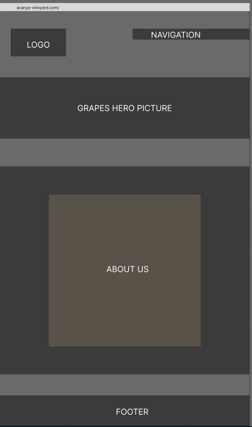
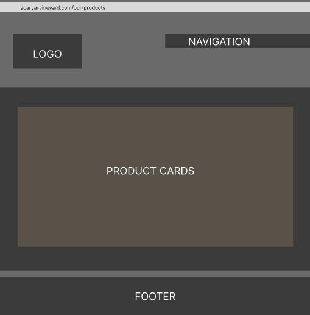
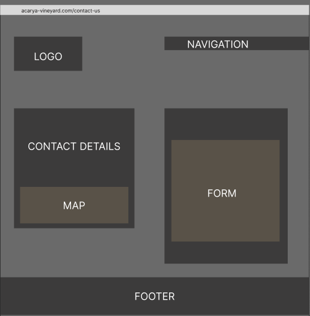

<h1>Welcome to ACARYA Vineyard & Winery Website</h1>

This is the main website for ACARYA Vineyard & Winery.

## User Experience:

### User Stories:

#### First Time Visitor Goals:

    1. As a First Time Visitor I want to be able to find the informations about the company.
    2. As a First Time Visitor I want to easly navigate through the website to find the content I'm interested with.
    3. As a First Time Visitor I want to find the company's testimonials and social media links to verify the authenticity of the company.

#### Returning Visitor Goals:

    1. As a Returning Visitor I want to find the information about the company's offer.
    2. As a Returning Visitor I want to be able to easily find the company's physical adress, so I can plan my future visits.
    3. As a Returning Visitor I want to be able to contact the company in case of having any queries.

#### Frequent Visitor Goals:

    1. As a Frequent Visitor I want to see that the range of available products is being updated regurarly.
    2. As a Frequent Visitor I want to be able to share my feedback with the owners.
    3. As a Frequent Visitor I want to be able to enjoy using the website on a various screen sizes thanks to a responsive layout.

    
        
### Design:

#### Colour Scheme: 

    - Main colours used are shades of grey and beige, which correspond to ACARYA's logo and background.

 #### Typography:

    - Poiret One and Great Vibes have been chosen as the headings fonts as they've been used in the logo and they provide elegant, aesthetically pleasing experience for a user.
    - Montserrat has been used as a main body elements. It's a popular and commonly used font in programming. Thanks to it's clean and simple design it compliments the decorative aspects of the headings.
    - Sans Serif and Helvetica are used as a fallback fonts in case of the main fonts not being imported into the site.
       
#### Imagery:

    - Imagery is crucial, as it gives the first impression of what ACARYA's website is about. The hero image represents clusters of freshly picked white grapes, which corresponds with the main line of the business. The warm colours of the picture are in perfect harmony with the website's colour scheme.

#### Wireframes:

Wireframes have been created with a use of [Figma](https://www.figma.com/)

    - About Us page:

    - Products page:

    - Contact page:

        
## Languages Used:

- [HTML5](https://en.wikipedia.org/wiki/HTML5)
- [CSS3](https://en.wikipedia.org/wiki/CSS)

## Credits:

### Pictures:

    - grapes-header.png - Photo by Christoph Schütz from pixabay.com
    - wine-pouring.png - Photo by Zsanett Mezei from pixabay.com
    - grape-hand.jpg & vineyard-uphill.jpg - Image by Krzysztof Wójcik
    - red-wine.jpg- Photo by Ron Lach from pexels.com
    - white-wine.jpg- Photo by Steven Weeks from unsplash.com
    - rose-wine.jpg- Photo by Maria Orlova from pexels.com
    - mead.jpg- Photo by Mona Miller on unsplash.com

### Code:

- Blur effect code from [css.glass by miketromba](https://css.glass/)
- Solution for hero image animation not working properly from [here](https://blog.hubspot.com/website/css-animation-not-working)

### Other Acknowledgements:

    - To Code Institute's Student Care for support and constructive review.
    - To my partner for sharing opinion about my aesthetic choices. 
    - Special thanks to my Mentor Narender Singh for all the help and support.

## Frameworks, Libraries & Programs Used

1. [Google Fonts:](https://fonts.google.com/)

    - Google fonts were used to import the Poiret One, Great Vibes and Montserrat fonts into the style.css file which are used on all pages throughout the project.

2. [Font Awesome:](https://fontawesome.com/)

    - Font Awesome has been used to import the social media icons in the footer.

3. [Git](https://git-scm.com/)

    - Git was used for version control by utilizing the Gitpod and Codeanywhere terminals to commit to Git and Push to GitHub.
    
4. [GitHub:](https://github.com/)

    - GitHub is used to store the projects code after being pushed from Git.

5. [GIMP 2.10.34](https://www.gimp.org/)

    - GIMP was used to create the logo and for the edition of the pictures.

6. [Figma](https://www.figma.com/files/recent?fuid=1228098703522495310)

    -Figma was used for the early design planning.

## Known Bugs:

- 

## Future development:

- Hamburger menu on smaller screens.
- Improved media query to improve layout and funcionality on smaller screens.
- Adding an additional feedback, events and testimonials sections.
